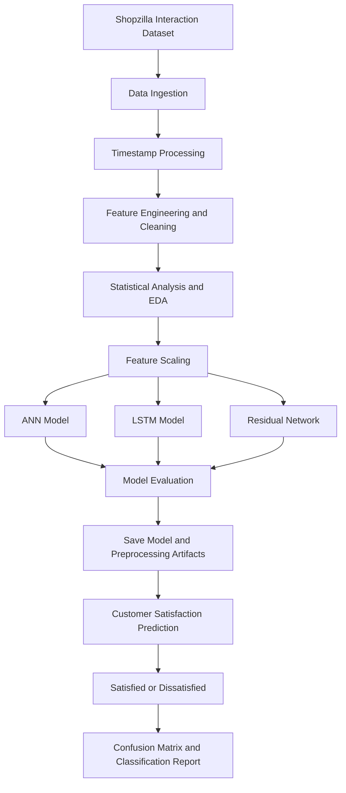

# 🛍️ DeepCSAT
### E-Commerce Customer Satisfaction Score Prediction

## 📌 Overview

DeepCSAT is a deep learning-based customer satisfaction prediction system designed to help e-commerce businesses evaluate customer support interactions and identify potentially dissatisfied customers.

Traditional customer satisfaction measurement often depends on surveys collected after an interaction. DeepCSAT aims to support a more proactive approach by analyzing interaction-related features such as response time, support channel, issue category, and customer tenure.

The project uses multiple deep learning architectures, including Artificial Neural Networks (ANN), Long Short-Term Memory (LSTM), and Deep Residual Networks, to predict customer satisfaction outcomes.

The system transforms raw customer interaction logs into a structured dataset, performs statistical analysis and feature engineering, and prepares trained models for inference.

### 🎯 Business Objectives

- **Early Dissatisfaction Detection:** Identify customers who may be dissatisfied before they churn.
- **Support Performance Monitoring:** Understand how response time and support channels relate to satisfaction.
- **Operational Improvement:** Help businesses identify areas where customer support needs attention.
- **Data-Driven Decisions:** Convert customer interaction data into actionable service insights.
- **Proactive Customer Experience:** Move beyond reactive surveys toward predictive satisfaction analysis.

## ✨ Key Features

- 🤖 **Deep Learning Models:** Implements ANN, LSTM, and Deep Residual Network architectures.
- ⏱️ **Response Time Analysis:** Calculates response duration from issue reporting and response timestamps.
- 📅 **Temporal Feature Engineering:** Extracts hour, day, and weekend indicators.
- 📊 **Statistical Hypothesis Testing:** Uses t-tests and chi-square tests to investigate relationships between support features and CSAT.
- ⚖️ **Class Imbalance Handling:** Uses class weighting to address the skewed distribution of satisfaction scores.
- 🔍 **Feature Scaling:** Applies StandardScaler to numerical features.
- 💾 **Model Serialization:** Saves model and preprocessing artifacts for consistent inference.
- 📈 **Model Evaluation:** Generates confusion matrices and classification reports.
- 🧑‍💻 **Customer Support Insights:** Supports analysis of interaction category, channel, tenure, and response time.

## 🏗️ System Architecture

DeepCSAT follows a machine learning pipeline that transforms customer support logs into predictions that can support service-quality monitoring.



## 🔄 Project Workflow

### 1. Data Ingestion

The pipeline loads more than 100,000 customer interaction records from the Shopzilla dataset.

These records contain information about customer support interactions and satisfaction-related outcomes.

### 2. Data Preprocessing

The raw data is prepared for analysis and model training.

The preprocessing stage includes:

- Standardizing issue reporting and response timestamps.
- Calculating response time in minutes.
- Removing irrelevant ID columns.
- Removing high-cardinality metadata, such as agent and manager names, to reduce the risk of overfitting.

### 3. Feature Engineering

Temporal and interaction-related features are created to help the models identify patterns associated with customer satisfaction.

### 4. Exploratory Data Analysis

The project analyzes the distribution of CSAT scores and investigates how customer support characteristics relate to satisfaction.

The report identifies a skewed CSAT distribution, motivating the use of class weighting during model training.

### 5. Statistical Hypothesis Testing

Statistical tests are applied to examine the relationships between input variables and satisfaction outcomes.

### 6. Feature Scaling

StandardScaler is applied to numerical features, including response time, to standardize their scale for model training.

### 7. Model Training

Three deep learning architectures are implemented and compared:

- Deep Artificial Neural Network
- Long Short-Term Memory network
- Deep Residual Network

### 8. Model Evaluation

The models are assessed using confusion matrices and classification reports, including precision and recall, to examine their ability to identify dissatisfied customers.

### 9. Model Serialization

The trained model is saved in Keras format. Joblib is used to save the scaler and feature list to support consistent preprocessing during inference.

## 🧹 Data Preprocessing and Feature Engineering

The project transforms raw customer support interaction logs into a structured dataset suitable for predictive modeling.

### Timestamp Processing

The `Issue reported at` and `Issue responded` fields are standardized to calculate response time in minutes.

### Temporal Features

The following features are derived from timestamps:

| Feature | Purpose |
|---|---|
| Hour | Identifies potential patterns across hours of the day |
| Day | Captures day-related patterns in support interactions |
| Weekend | Distinguishes weekend interactions from other interactions |
| Response Time | Measures the duration between reporting an issue and receiving a response |

### Interaction Features

The model uses the following features described in the report:

- Interaction category
- Support channel name
- Customer tenure bucket
- Response time

These features help the system examine how interaction characteristics relate to customer satisfaction.

### Feature Selection

Irrelevant ID columns and high-cardinality metadata, including agent and manager names, are removed to reduce unnecessary complexity and help prevent overfitting.

## 📊 Statistical Analysis

The project uses statistical hypothesis testing to investigate the relationship between support interaction characteristics and customer satisfaction.

### T-Tests

T-tests are used to examine whether response time and weekend support significantly affect CSAT scores.

### Chi-Square Tests

Chi-square tests are used to examine the relationship between satisfaction levels and the following variables:

- Support channel
- Issue category
- Customer tenure

The report states that these tests identified significant relationships. Exact test statistics, p-values, and effect sizes are not provided in the project document.

## 🧠 Deep Learning Models

DeepCSAT implements three deep learning architectures to model patterns in customer support interactions.

### 1. Deep Artificial Neural Network (ANN)

The ANN serves as the baseline model.

**Architecture described in the report:**

- Dense layer with 512 units
- Dense layer with 256 units
- Dense layer with 128 units
- Batch Normalization
- Dropout with a rate of 0.4

The network is designed to learn nonlinear relationships between customer support features and satisfaction outcomes while using regularization techniques to improve training stability.

### 2. Long Short-Term Memory (LSTM)

LSTM is evaluated for its ability to capture potential temporal dependencies in interaction data.

The input data is reshaped into a three-dimensional sequence format suitable for an LSTM architecture.

This model explores whether sequence-based learning can help identify patterns associated with customer satisfaction.

### 3. Deep Residual Network

The Deep Residual Network uses a skip connection implemented with an `Add()` layer.

Skip connections allow information and gradients to flow through deeper network structures, helping address vanishing-gradient challenges during training.

The model is intended to capture complex patterns in customer support interactions.

## ⚖️ Class Imbalance Handling

The project identifies a skewed distribution of CSAT scores during exploratory analysis.

Class weighting is used during training to help address the imbalance between satisfaction outcomes.

This is particularly important when the business objective is to identify dissatisfied customers, because a model that performs well on the majority class may still miss customers who need attention.

## 📈 Model Evaluation

The project compares ANN, LSTM, and Residual Network architectures.

| Model | Role and Reported Observation |
|---|---|
| Deep ANN | Baseline model with high computational efficiency |
| LSTM | Evaluated for its ability to process interaction sequences |
| Deep Residual Network | Uses skip connections to learn complex interaction patterns |

### Evaluation Outputs

The system generates:

- Confusion matrices
- Classification reports
- Precision
- Recall

These outputs help assess the model's ability to identify satisfied and dissatisfied customers.

### Prediction Output

The project describes a binary classification output:

- **Satisfied**
- **Dissatisfied**

The classification is based on predicted CSAT score thresholds.

The report does not provide numerical accuracy, precision, recall, F1-score, or a definitive winning architecture. Therefore, no specific model is presented here as the best-performing model.

## 💾 Model Serialization and Inference

The project saves model and preprocessing artifacts to support consistent prediction workflows.

- **Keras model:** Stores the trained deep learning model in `.keras` format.
- **Joblib:** Stores the scaler and feature list.
- **Consistent preprocessing:** Helps ensure that input features are prepared in the expected format during inference.

The report describes the model as prepared for ongoing predictions in a production environment. It does not provide enough detail to confirm a particular cloud deployment, API endpoint, or production dashboard implementation.

## 🛠️ Technology Stack

| Category | Technologies |
|---|---|
| Programming Language | Python |
| Deep Learning | Artificial Neural Networks, LSTM, Residual Networks |
| Neural Network Framework | Keras |
| Data Processing | Timestamp processing and feature engineering |
| Feature Scaling | StandardScaler |
| Statistical Analysis | T-tests, chi-square tests |
| Model Evaluation | Confusion Matrix, Precision, Recall, Classification Report |
| Model Serialization | Keras format, Joblib |
| Dataset | Shopzilla customer interaction data |

*The report does not specify every library version or provide a complete dependency list.*

## ⚙️ Setup and Execution

The project report describes the modeling workflow and artifact formats, but it does not include the exact repository file structure, training script name, inference script name, or complete installation instructions.

The following commands provide a general environment setup for the documented Python-based workflow.

### 1. Create a virtual environment

```bash id="deepcsat_venv"
python -m venv venv
```

Activate it on Windows:

```bash id="deepcsat_win"
venv\Scripts\activate
```

On macOS or Linux:

```bash id="deepcsat_linux"
source venv/bin/activate
```

### 2. Install the core libraries

```bash id="deepcsat_install"
pip install pandas numpy scipy scikit-learn tensorflow joblib
```

### 3. Prepare the dataset

Place the Shopzilla dataset in the location expected by the project's preprocessing pipeline.

### 4. Prepare model artifacts

Ensure the trained `.keras` model, scaler, and feature list are saved and accessible to the inference workflow.

### 5. Run the project

Execute the project's actual training or inference script according to its filenames and configuration.

**Note:** These are general setup instructions inferred from the documented technology stack, not verified repository-specific commands. The exact scripts, dataset paths, model filenames, and dependency versions should be confirmed from the source code.

## 💼 Business Applications

DeepCSAT demonstrates how customer support interaction data can be used to support customer experience management.

Potential applications include:

- **E-commerce support teams:** Identify potentially dissatisfied customers.
- **Customer experience teams:** Investigate the relationship between response time and satisfaction.
- **Support operations managers:** Compare service patterns across support channels.
- **Quality monitoring teams:** Track interaction outcomes using predictive insights.
- **Customer retention teams:** Use dissatisfaction predictions to prioritize follow-up.

The project provides a foundation for proactive customer support analysis. Its actual impact on churn, loyalty, or retention would need to be measured in a live environment.

## ⚠️ Limitations

Based on the project report:

- Numerical model performance metrics are not provided.
- The report compares architectures but does not identify a definitive best-performing model.
- The exact CSAT thresholds used for binary classification are not specified.
- The report does not include detailed statistical test values or p-values.
- Live deployment results and measured business improvements are not provided.
- The report does not establish that the system is connected to a live customer support platform.

## 🚀 Future Enhancements

### 1. Neural Collaborative Filtering

Explore Neural Collaborative Filtering to model product-user interactions and support more personalized customer experiences.

### 2. A/B Testing

Deploy the system in a live environment and evaluate its impact on customer retention and conversion.

### 3. Dynamic Recovery Discounts

Explore targeted recovery discounts for customers predicted to have low satisfaction scores, subject to business rules and controlled evaluation.

### 4. Further Model Validation

Compare the ANN, LSTM, and Residual Network using consistent validation procedures and clearly reported metrics, including precision, recall, F1-score, and confusion matrices.

These enhancements reflect the future roadmap described in the project report, with further model validation suggested as an additional improvement.

## 📌 Project Information

- **Project Name:** DeepCSAT
- **Full Title:** E-Commerce Customer Satisfaction Score Prediction
- **Project Type:** Deep Learning and Predictive Analytics
- **Domain:** E-Commerce and Customer Experience Analytics
- **Author:** Piyush Chavda
- **Date:** February 25, 2026
- **Dataset:** Shopzilla customer interaction data
- **Model Architectures:** ANN, LSTM, Deep Residual Network
- **Prediction Task:** Satisfied vs. Dissatisfied

## 🏁 Conclusion

DeepCSAT applies deep learning to customer support interaction data to predict customer satisfaction and support proactive service-quality analysis.

By combining timestamp processing, behavioral feature engineering, statistical hypothesis testing, and multiple neural network architectures, the project explores how support interaction characteristics can be used to identify potentially dissatisfied customers.

The project provides a foundation for predictive customer experience analytics, with future opportunities to evaluate model performance more rigorously, test business impact through A/B experiments, and explore targeted customer recovery strategies.
